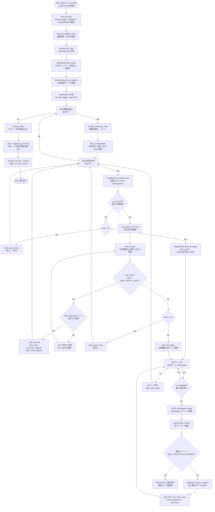

# 1. フローチャート — システム全体の処理フロー (webScraping)

```mermaid
flowchart TD
    A(["Start: python -m src.main<br>--prefectures 東京都"]) --> B[main.py: main<br>RecordLogger / Database / ProgressState 初期化]
    B --> C[main.py: validate_input<br>都道府県・日付の検証]
    C --> D[config.ensure_dirs<br>data/logs/state 作成]
    D --> E[SiteSession.fetch_index<br>CSRFトークン + 初期フォーム取得]
    E --> E1[SiteSession.get_era_options<br>元号変換テーブル取得]
    E1 --> F[PageFetcher 生成<br>site / db / logger / state 注入]

    F --> G[次の都道府県は<br>あるか？]
    G -->|Yes| H[resolve_prefecture_code<br>都道府県名 → コード]
    H --> I[fetch_municipalities<br>市区町村一覧を JSON AJAX 取得]
    I --> J[次の市区町村は<br>あるか？]
    J -->|Yes| K[PageFetcher.process_area<br>初期クエリ POST viewPageNo=1]
    K --> L{is_over_limit?<br>表示上限超過?}

    L -->|No| M{total &gt; 0?}
    M -->|No| M1[mark_query_done<br>0件として完了]
    M1 --> J
    M -->|Yes| N["PageFetcher.fetch_all_pages<br>total_pages = ceil(total/PAGE_SIZE)"]
    N --> N1[次のページは<br>あるか？ 1..total_pages]
    N1 -->|Yes| N2{is_completed?<br>既に保存済み}
    N2 -->|Yes| N1
    N2 -->|No| N3[POST viewPageNo=page<br>searchFlg=0 でページ取得]
    N3 --> N4[parser.parse_results<br>法人レコード抽出]
    N4 --> N5{連続エラー &gt;=<br>MAX_CONSECUTIVE_ERRORS?}
    N5 -->|No| N6[Database.upsert_company<br>法人番号PKで UPSERT]
    N6 --> N7[add_fetch_log + fetch_logs<br>mark_completed + state.save]
    N7 --> N1
    N5 -->|Yes| Z1[RuntimeError 安全停止<br>連続エラー数超過]

    L -->|Yes| O[log_query_over_limit<br>日付分割の開始]

    O --> P[collect_range<br>日付範囲を2分割しながら再帰]
    P --> Q{over または<br>total &gt; MAX_DISPLAY_LIMIT?}
    Q -->|Yes| R{date_range.days &lt;= 1?<br>単日でも超過}
    R -->|Yes| S[_skip_oversize<br>fetch_logs: over_limit_skipped<br>state: mark_skipped]
    S --> J
    R -->|No| T[mid で左右に分割<br>left / right を再帰]
    T --> P
    Q -->|No| U{total == 0?}
    U -->|Yes| U1[mark_query_done<br>枝刈り]
    U1 --> J
    U -->|No| V[fetch_all_pages<br>分割範囲の全ページ取得]
    V --> N1

    N1 -->|No| W[全ページ完了<br>mark_query_done]
    W --> J
    J -->|No| G
    G -->|No| X[format_output<br>サマリー文字列組み立て]
    X --> Y[print + logger.log_summary<br>総ページ/成功/失敗/失敗URL]
    Y --> Z[db.add_run_log + commit<br>status: ok / with_errors]
    Z --> Z2([End: 実行完了])
```