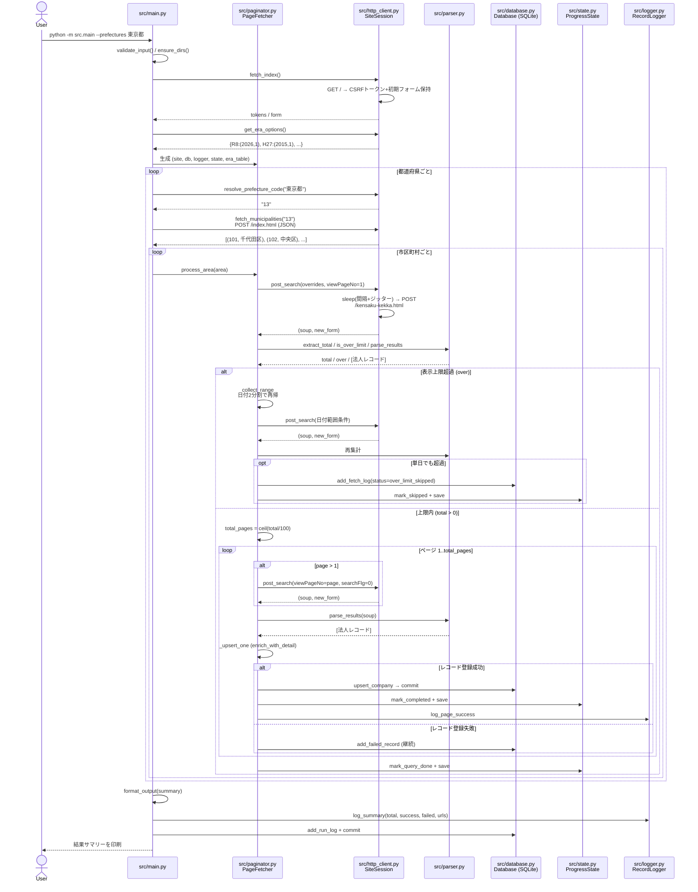

# 2. シーケンス図 — スクレイピング実行のモジュール間通信 (webScraping)

```mermaid
sequenceDiagram
    actor User
    participant Main as src/main.py
    participant Fetcher as src/paginator.py<br>PageFetcher
    participant Session as src/http_client.py<br>SiteSession
    participant Parser as src/parser.py
    participant DB as src/database.py<br>Database (SQLite)
    participant State as src/state.py<br>ProgressState
    participant Logger as src/logger.py<br>RecordLogger

    User->>Main: python -m src.main --prefectures 東京都
    Main->>Main: validate_input() / ensure_dirs()
    Main->>Session: fetch_index()
    Session->>Session: GET / → CSRFトークン+初期フォーム保持
    Session-->>Main: tokens / form
    Main->>Session: get_era_options()
    Session-->>Main: {R8:(2026,1), H27:(2015,1), ...}

    Main->>Fetcher: 生成 (site, db, logger, state, era_table)

    loop 都道府県ごと
        Main->>Session: resolve_prefecture_code("東京都")
        Session-->>Main: "13"
        Main->>Session: fetch_municipalities("13")<br>POST /index.html (JSON)
        Session-->>Main: [(101, 千代田区), (102, 中央区), ...]

        loop 市区町村ごと
            Main->>Fetcher: process_area(area)
            Fetcher->>Session: post_search(overrides, viewPageNo=1)
            Session->>Session: sleep(間隔+ジッター) → POST<br>/kensaku-kekka.html
            Session-->>Fetcher: (soup, new_form)
            Fetcher->>Parser: extract_total / is_over_limit / parse_results
            Parser-->>Fetcher: total / over / [法人レコード]

            alt 表示上限超過 (over)
                Fetcher->>Fetcher: collect_range<br>日付2分割で再帰
                Fetcher->>Session: post_search(日付範囲条件)
                Session-->>Fetcher: (soup, new_form)
                Fetcher->>Parser: 再集計
                opt 単日でも超過
                    Fetcher->>DB: add_fetch_log(status=over_limit_skipped)
                    Fetcher->>State: mark_skipped + save
                end
            else 上限内 (total > 0)
                Fetcher->>Fetcher: total_pages = ceil(total/100)
                loop ページ 1..total_pages
                    alt page > 1
                        Fetcher->>Session: post_search(viewPageNo=page, searchFlg=0)
                        Session-->>Fetcher: (soup, new_form)
                    end
                    Fetcher->>Parser: parse_results(soup)
                    Parser-->>Fetcher: [法人レコード]
                    Fetcher->>Fetcher: _upsert_one (enrich_with_detail)
                    alt レコード登録成功
                        Fetcher->>DB: upsert_company → commit
                        Fetcher->>State: mark_completed + save
                        Fetcher->>Logger: log_page_success
                    else レコード登録失敗
                        Fetcher->>DB: add_failed_record (継続)
                    end
                end
                Fetcher->>State: mark_query_done + save
            end
        end
    end

    Main->>Main: format_output(summary)
    Main->>Logger: log_summary(total, success, failed, urls)
    Main->>DB: add_run_log + commit
    Main-->>User: 結果サマリーを印刷
```