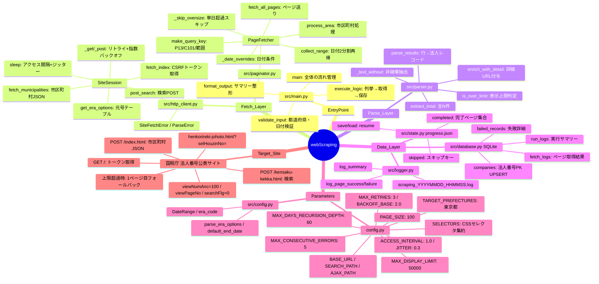

# 4. マインドマップ — システム概念の階層整理 (webScraping)

```mermaid
mindmap
  root((webScraping))
    EntryPoint
      src/main.py
        main: 全体の流れ管理
        validate_input: 都道府県・日付検証
        execute_logic: 列挙→取得→保存
        format_output: サマリー整形
    Fetch_Layer
      src/http_client.py
        SiteSession
          fetch_index: CSRFトークン取得
          post_search: 検索POST
          fetch_municipalities: 市区町村JSON
          get_era_options: 元号テーブル
          sleep: アクセス間隔+ジッター
          _get/_post: リトライ+指数バックオフ
        SiteFetchError / ParseError
      src/paginator.py
        PageFetcher
          process_area: 市区町村処理
          collect_range: 日付2分割再帰
          fetch_all_pages: ページ送り
          make_query_key: P13/C101/範囲
          _date_overrides: 日付条件
          _skip_oversize: 単日超過スキップ
    Parse_Layer
      src/parser.py
        parse_results: 行→法人レコード
        extract_total: 全N件
        is_over_limit: 表示上限判定
        _text_without: 非破壊抽出
        enrich_with_detail: 詳細URL付与
    Data_Layer
      src/database.py SQLite
        companies: 法人番号PK UPSERT
        fetch_logs: ページ取得結果
        failed_records: 失敗詳細
        run_logs: 実行サマリー
      src/state.py progress.json
        completed: 完了ページ集合
        skipped: スキップキー
        save/load: resume
      src/logger.py
        scraping_YYYYMMDD_HHMMSS.log
        log_page_success/failure
        log_summary
    Parameters
      config.py
        BASE_URL / SEARCH_PATH / AJAX_PATH
        TARGET_PREFECTURES: 東京都
        PAGE_SIZE: 100
        MAX_DISPLAY_LIMIT: 50000
        ACCESS_INTERVAL: 1.0 / JITTER: 0.3
        MAX_RETRIES: 3 / BACKOFF_BASE: 2.0
        MAX_CONSECUTIVE_ERRORS: 5
        MAX_DAYS_RECURSION_DEPTH: 60
        SELECTORS: CSSセレクタ集約
      src/config.py
        DateRange / era_code
        parse_era_options / default_end_date
    Target_Site
      国税庁 法人番号公表サイト
        GET /: トークン取得
        POST /kensaku-kekka.html: 検索
        POST /index.html: 市区町村JSON
        viewNumAnc=100 / viewPageNo / searchFlg=0
        上限超過時: 1ページ目フォールバック
        henkorireki-johoto.html?selHouzinNo=
```