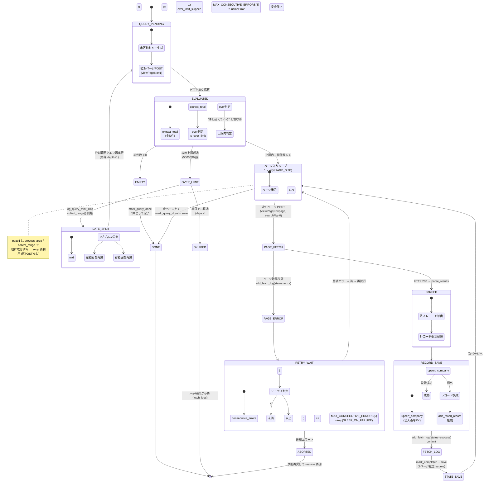

# 5. 状態遷移図 — 検索クエリのライフサイクル (webScraping)

```mermaid
stateDiagram-v2
    [*] --> QUERY_PENDING

    state QUERY_PENDING {
        [*] --> 市区町村キー生成
        市区町村キー生成 --> 初期ページPOST<br>(viewPageNo=1)
    }

    QUERY_PENDING --> EVALUATED: HTTP 200 応答
    state EVALUATED {
        [*] --> extract_total<br>(全N件)
        extract_total --> over判定<br>is_over_limit
        over判定 --> 上限内判定: "件を超えている" を含むか
    }

    EVALUATED --> EMPTY: 総件数 = 0
    EVALUATED --> OVER_LIMIT: 表示上限超過<br>(50000件超)
    EVALUATED --> PAGE_LOOP: 上限内・総件数 N &gt; 0

    EMPTY --> DONE: mark_query_done<br>0件として完了

    OVER_LIMIT --> DATE_SPLIT: log_query_over_limit<br>collect_range() 開始
    state DATE_SPLIT {
        [*] --> mid で左右に2分割
        mid で左右に2分割 --> 左範囲を再帰
        mid で左右に2分割 --> 右範囲を再帰
    }
    DATE_SPLIT --> QUERY_PENDING: 分割範囲クエリ再実行<br>(再帰 depth+1)
    OVER_LIMIT --> SKIPPED: 単日でも超過<br>(days &lt;= 1)<br>over_limit_skipped

    PAGE_LOOP: ページ送りループ<br>1..ceil(N/PAGE_SIZE)
    PAGE_LOOP --> PAGE_FETCH: 次のページ POST<br>(viewPageNo=page, searchFlg=0)
    state PAGE_LOOP {
        [*] --> ページ番号 1..N
    }

    PAGE_FETCH --> PARSED: HTTP 200 → parse_results
    state PARSED {
        [*] --> 法人レコード抽出
        法人レコード抽出 --> レコード個別処理
    }

    PARSED --> RECORD_SAVE
    state RECORD_SAVE {
        [*] --> upsert_company<br>(法人番号PK)
        upsert_company --> 成功: 登録成功
        upsert_company --> レコード失敗: 例外
        レコード失敗 --> add_failed_record<br>継続
    }

    RECORD_SAVE --> FETCH_LOG: add_fetch_log(status=success)<br>commit
    FETCH_LOG --> STATE_SAVE: mark_completed + save<br>(1ページ粒度resume)
    STATE_SAVE --> PAGE_LOOP: 次ページへ

    PAGE_LOOP --> DONE: 全ページ完了<br>mark_query_done + save

    PAGE_FETCH --> PAGE_ERROR: ページ取得失敗<br>add_fetch_log(status=error)
    PAGE_ERROR --> RETRY_WAIT

    state RETRY_WAIT {
        [*] --> consecutive_errors += 1
        consecutive_errors += 1 --> リトライ判定
        リトライ判定 --> 未満: &lt; MAX_CONSECUTIVE_ERRORS(5)<br>sleep(SLEEP_ON_FAILURE)
        リトライ判定 --> 以上
    }

    RETRY_WAIT --> PAGE_LOOP: 連続エラー未満 → 再試行
    RETRY_WAIT --> ABORTED: 連続エラー &gt;= MAX_CONSECUTIVE_ERRORS(5)<br>RuntimeError 安全停止

    DONE --> [*]
    SKIPPED --> [*]: 人手確認が必要 (fetch_logs)
    ABORTED --> [*]: 次回再実行で resume 再開

    note right of PAGE_LOOP
        page1 は process_area / collect_range で
        既に取得済み → soup 再利用 (再POSTなし)
    end note
```